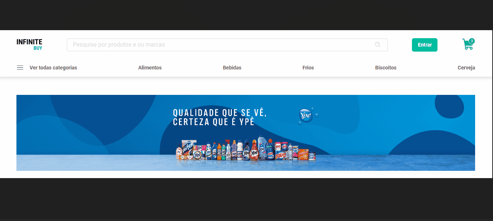

# Infinity Buy

Bem-vindo ao Infinity Buy.

## Documentação

- [Documentação](#)
- [Status do Projeto](#status-do-projeto)
- [Descrição do Projeto](#descrição-do-projeto)
- [Funcionalidades](#funcionalidades)
- [Guia de Padronização](#guia-de-padronização)
- [Design System](#design-system)
- [Tecnologias Principais](#tecnologias-principais)
- [Bibliotecas de Apoio](#bibliotecas-de-apoio)
- [Ferramentas](#ferramentas)
- [Aplicação](#aplicação)
- [Deploy](#deploy)
- [Desenvolvedores](#desenvolvedores)
- [Executando o Projeto WEB Localmente](#executando-o-projeto-web-localmente)
- [Deixe Sugestões e Ideias](#deixe-sugest%C3%B5es-e-ideias)

## Status do Projeto

      Projeto em construção

## Descrição do Projeto

O Infinity Buy é um sistema de e-commerce voltado inicialmente para supermercados. Ele proporciona aos usuários a experiência de realizar compras online, explorar produtos e aproveitar ofertas, tanto para usuários logados quanto para visitantes não autenticados. Os usuários não autenticados têm a capacidade de visualizar produtos e ofertas, enquanto os usuários autenticados podem realizar compras, adicionar itens ao carrinho e finalizar suas transações.

## Funcionalidades

### 🔓 Área de Usuários não Logados:

#### Autenticação:

- **Login:** Permite que os usuários autentiquem-se utilizando seu email e senha cadastrados previamente.
- **Cadastro:** Permite que novos usuários se cadastrem na plataforma fornecendo informações como nome, email e senha.
- **Recuperação de Senha ( Em Produção ):** Recurso que permitirá que usuários solicitem a recuperação de sua senha por meio do envio de um email com instruções para redefinição de senha.

#### Home:

- Menu do usuário
- Barra de pesquisa
- Ícone para o carrinho de compras
- Banner de promoções
- Lista de produtos
- Menu de categorias de produtos

#### Página de Detalhes do Produto:

         Em Produção !

### 🔒 Área do Usuário logado (Consumidor):

> Os usuários logados têm acesso a todas as funcionalidades disponíveis para os usuários não logados e mais:

- **Navegação Completa:** Os consumidores logados têm acesso total a todas as áreas da plataforma, incluindo navegação por categorias de produtos, visualização de detalhes de produtos e ofertas, e acesso ao carrinho de compras.

- **Adicionar ao Carrinho:** Os consumidores podem adicionar itens desejados ao seu carrinho de compras para facilitar o processo de compra posteriormente.

- **Finalizar Compras:** Os usuários logados têm a capacidade de finalizar suas compras, revisar os itens no carrinho e proceder ao processo de pagamento para concluir suas transações.

- **Perfil do Usuário (Em Produção):** Os consumidores terão a possibilidade de visualizar seu perfil, incluindo informações pessoais, histórico de compras e outras configurações relacionadas à conta.

Além disso, os consumidores também podem desfrutar de funcionalidades adicionais, como histórico de compras, gerenciamento de perfil e configurações de conta.

#### Carrinho:

> A seção do carrinho é essencial para a experiência de compra do usuário. Aqui estão algumas das funcionalidades que estarão disponíveis:

- **Visualização de Itens Adicionados:** Os usuários podem verificar todos os itens que adicionaram ao seu carrinho, incluindo detalhes como nome do produto, quantidade e preço.

- **Acréscimo de Quantidade:** Os consumidores têm a capacidade de aumentar a quantidade de um item no carrinho, caso desejem comprar mais unidades do mesmo produto.

- **Diminuição de Quantidade:** Da mesma forma, os usuários podem diminuir a quantidade de um item no carrinho, caso desejem comprar menos unidades do produto.

- **Remoção de Itens:** Os consumidores podem remover itens do carrinho, caso decidam não comprar mais aquele produto.

- **Finalização da Compra (Em Produção):** Após revisar e ajustar os itens no carrinho, os usuários podem proceder à finalização da compra, onde serão direcionados para o processo de pagamento e conclusão da transação.

Essas funcionalidades garantem que os usuários tenham controle total sobre os itens que desejam comprar e oferecem uma experiência de compra conveniente e personalizada.

## Guia de Padronização

- Será usado versão 18 do node;
- Nomes de variáveis e funções devem seguir o padrão camelCase;
- Valores imutáveis devem seguir o padrão SNAKE_UPPERCASE_WITH;
- Apenas um component react por arquivo, sem uso de export default;
- Arquivos e pastas devem seguir o padrão camelCase;
- Components devem estar numa pasta com o nome do component em PascalCase;
- A pasta do componente terá: index.tsx - arquivo do componente, styled.ts - styled-component, component.test.ts - arquivo de teste;
- Quando o componente necessitar de mais de uma tipagem, colocar as tipagens num arquivo chamado types.ts dentro da pasta do componente;
- Tipagem de props deve seguir o padrão ComponentNameProps;
- Todos os arquivos deverão estar nas suas devidas pastas, conforme está estruturado o repositório;
- Todo o código-fonte deve ser escrito em inglês. Isso inclui nomes de variáveis, funções, classes, etc;

## Design System

Utilizei alguns conceitos e ferramentas para padronizar várias etapas do projeto.

- **Aplicação das regras e padrões**: ESLint
- **Formatação automática com base nas regras**: Prettier
- **Gitflow**: Padrão de commits: Convencional Commits

## Tecnologias Principais

## Bibliotecas de Apoio

    react-hook-form: 3.3.4
    styled-components: 5.1.29
    axios: 1.5.1
    react: 18.2.0
    react-dom": 18.2.0
    react-hook-form": 7.49.3
    react-icons": 4.12.0
    react-modal": 3.16.1
    react-responsive": 9.0.2
    react-router-dom": 6.21.0
    react-toastify": 10.0.0
    styled-components": 6.1.0
    yup": 1.3.3

## Ferramentas

      - NPM
      - Git
      - Gitflow
      - Trello

## Fluxo de Trabalho

> https://trello.com/b/qeOyoqTS/infinitebuyweb

## Aplicação

### Telas

  

## Deploy

> https://infinite-buy.vercel.app/

## Desenvolvedores

<table align="center">
   <tr>
    <td align="center">
      

         
          <b> Karine Pereira da Silva </b> 
          <b> Desenvolvedora Web Frontend </b> 
            
            

  </tr>

  </tr>

  <tr>
    <td align="center">
      

          
          <b>Kelvin Charles da Cruz</b> 
          <b> Desenvolvedor Web Frontend</b> 
            
         

  </tr>

  <tr>
    <td align="center">
      

         
          <b> Paulo Braz</b> 
          <b> Desenvolvedor Web Fullstack. </b> 
            
             

  </tr>

</table>

## Executando o projeto web localmente

> Projeto iniciado usando npm create vite@latest.

- Clone o projeto com

  > git clone https://github.com/paulobr4z/infinite_buy_web.git

- Vá para a raiz do diretório

  > cd infinite_buy_web

- Instale as dependências

  > npm install

- Inicie o servidor local

  > npm run dev

- Analisar erros padrões com ESLint

  > npm run lint

- Formata código corretamente

  > npm run format
